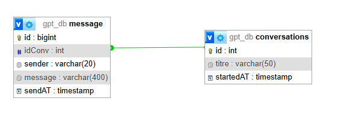

# My-ChatGPT

## Fonctionnalités

- Créer, renommer et supprimer des conversations.
- Envoyer des messages et recevoir des réponses générées par une IA.
- Afficher le raisonnement de l'IA pour chaque réponse.
- Interface utilisateur, gestion des conversations.

## Technologies utilisées

- **Frontend** : HTML, CSS, JavaScript
- **Backend** : Node.js, Express.js
- **Base de données** : MySQL
- **API IA** : Hugging Face API
- **Autres dépendances** : dotenv, body-parser, cors, mysql2, node-fetch
  

## la base de donnée



```sql
-- Suppression et création de la base de données
DROP DATABASE IF EXISTS `gpt_db`;
CREATE DATABASE `gpt_db`;
USE `gpt_db`;

-- Création des tables
CREATE TABLE IF NOT EXISTS `conversations` (
  `id` int NOT NULL AUTO_INCREMENT,
  `idUser` int DEFAULT NULL,
  `startedAT` timestamp NULL DEFAULT CURRENT_TIMESTAMP,
  PRIMARY KEY (`id`),
  KEY `idUser` (`idUser`)
) ENGINE=InnoDB DEFAULT CHARSET=utf8mb4 COLLATE=utf8mb4_0900_ai_ci;

CREATE TABLE IF NOT EXISTS `message` (
  `id` int NOT NULL AUTO_INCREMENT,
  `idConv` int NOT NULL,
  `sender` varchar(20) NOT NULL,
  `message` varchar(255) NOT NULL,
  `sendAT` timestamp NOT NULL DEFAULT CURRENT_TIMESTAMP,
  PRIMARY KEY (`id`),
  KEY `idConv` (`idConv`)
) ENGINE=InnoDB DEFAULT CHARSET=utf8mb4 COLLATE=utf8mb4_0900_ai_ci;

-- Liaisons
ALTER TABLE `message`
  ADD CONSTRAINT `message_ibfk_1` FOREIGN KEY (`idConv`) REFERENCES `conversations` (`id`) ON DELETE RESTRICT ON UPDATE RESTRICT;
COMMIT;
```

## Installation

## Installation

### Installer
   ```bash
   git clone https://github.com/Formidabledu59/My-ChatGPT.git
```

### Mon architecture 
```
My-ChatGPT/
├── backend/                    
│   ├── controllers/
│   ├── routes/                 
│   ├── dbConfig.mjs            
│   ├── Express.mjs             
│   ├── testDbConnection.mjs    
│   └── ...                     
├── img/                        
│   ├── my_chatGPT.png          
│   ├── bdd.png                 
├── styles.css                  
├── scripts.js                  
├── index.html                  
├── README.md                   
├── .env                        
├── package.json                 
├── package-lock.json            
```
1. backend/ : Contient toute la logique côté serveur, y compris les routes, les contrôleurs et la configuration de la base de données.
2. img/ : Stocke les ressources visuelles comme les logos ou captures d'écran.
3. styles.css : Définit le style de l'interface utilisateur.
4. scripts.js : Contient la logique JavaScript pour gérer les interactions utilisateur.
5. index.html : Fichier HTML principal qui structure l'interface utilisateur.
6. README.md : Documentation du projet.
7. .env : Fichier pour stocker les variables sensibles comme les tokens API et les informations de connexion à la base de données.


### Dépendance
   ```bash
npm install
```
### Configurez les variables d'environnement dans le fichier 
```bash
HF_API_TOKEN=Votre_Token_Hugging_Face
DB_HOST=localhost
DB_USER=root
DB_PASSWORD=
DB_NAME=gpt_db
```
### Lancez le serveu
```bash
npm start
```
Et le serveur ecoute __http://localhost:5000__

## Routes

### 1. Créer une conversation

- **Méthode** : `POST`
- **Endpoint** : `/api/conversations`
- **Description** : Crée une nouvelle conversation.
- **Body attendu** :
  ```json
  {
    "nom": "Nom de la conversation",
    "participants": ["ID utilisateur 1", "ID utilisateur 2"]
  }
  ```

- **Réponse** :
  ```json
  {
    "id": "ID de la conversation",
    "nom": "Nom de la conversation",
    "participants": ["ID utilisateur 1", "ID utilisateur 2"],
    "date_creation": "Date de création"
  }
  ```

---

### 2. Récupérer toutes les conversations

- **Méthode** : `GET`
- **Endpoint** : `/api/conversations`
- **Description** : Récupère la liste des conversations.

- **Réponse** :
  ```json
  [
    {
      "id": "ID de la conversation",
      "nom": "Nom de la conversation",
      "participants": ["ID utilisateur 1", "ID utilisateur 2"],
      "date_creation": "Date de création"
    }
  ]
  ```

---

### 3. Renommer une conversation

- **Méthode** : `PUT`
- **Endpoint** : `/api/conversations/:id`
- **Description** : Renomme une conversation existante.
- **Body attendu** :
  ```json
  {
    "nom": "Nouveau nom de la conversation"
  }
  ```

- **Réponse** :
  ```json
  {
    "id": "ID de la conversation",
    "nom": "Nouveau nom de la conversation",
    "participants": ["ID utilisateur 1", "ID utilisateur 2"],
    "date_creation": "Date de création"
  }
  ```

---

### 4. Supprimer une conversation

- **Méthode** : `DELETE`
- **Endpoint** : `/api/conversations/:id`
- **Description** : Supprime une conversation par son ID.
- **Réponse** :
  ```json
  {
    "message": "Conversation supprimée avec succès."
  }
  ```

---

### 5. Ajouter un message

- **Méthode** : `POST`
- **Endpoint** : `/api/messages`
- **Description** : Ajoute un message à une conversation.
- **Body attendu** :
  ```json
  {
    "conversationId": "ID de la conversation",
    "expediteurId": "ID de l'expéditeur",
    "message": "Contenu du message"
  }
  ```

- **Réponse** :
  ```json
  {
    "id": "ID du message",
    "conversationId": "ID de la conversation",
    "expediteurId": "ID de l'expéditeur",
    "message": "Contenu du message",
    "date_envoi": "Date d'envoi"
  }
  ```

---

### 6. Récupérer les messages d'une conversation

- **Méthode** : `GET`
- **Endpoint** : `/api/messages/:idConv`
- **Description** : Récupère tous les messages d'une conversation donnée.
- **Réponse** :
  ```json
  [
    {
      "id": "ID du message",
      "conversationId": "ID de la conversation",
      "expediteurId": "ID de l'expéditeur",
      "message": "Contenu du message",
      "date_envoi": "Date d'envoi"
    }
  ]
  ```

---

### 7. Supprimer un message

- **Méthode** : `DELETE`
- **Endpoint** : `/api/messages/:id`
- **Description** : Supprime un message par son ID.
- **Réponse** :
  ```json
  {
    "message": "Message supprimé avec succès."
  }
  ```
